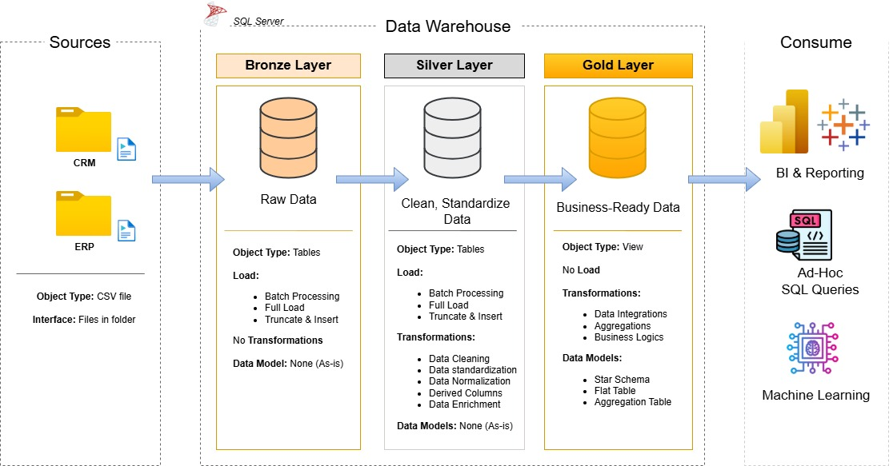

# Data Warehouse and Analytics Project

Welcome to the **Data Warehouse and Analytics Project** repository! 🚀

This project demonstrates the design and implementation of a modern Data Warehouse using SQL Server. The solution consolidates data from multiple source systems (ERP and CRM), transforms raw datasets into clean and standardized information, and delivers business-ready analytical models for reporting and decision-making.

The project follows the **Medallion Architecture** approach using Bronze, Silver, and Gold layers, which is widely adopted in modern data engineering and analytics platforms.

---

# 🏗️ Data Architecture

The project follows a three-layer Medallion Architecture.



## Bronze Layer

The Bronze Layer stores raw data exactly as received from source systems.

### Purpose

* Preserve original source data.
* Maintain a historical copy of imported datasets.
* Enable traceability and auditing.
* Serve as the foundation for downstream transformations.

### Data Sources

* CRM Data
* ERP Data

### Characteristics

* Raw CSV ingestion.
* No transformations applied.
* No data quality corrections.
* Source data stored as-is.

---

## Silver Layer

The Silver Layer focuses on data cleansing, standardization, and transformation.

### Purpose

* Improve data quality.
* Remove inconsistencies.
* Standardize formats.
* Prepare data for business analysis.

### Transformations Performed

* Duplicate removal
* Null value handling
* Data validation
* Standardization of text values
* Date formatting
* Business rule implementation

### Outcome

Clean, reliable, and analytics-ready datasets.

---

## Gold Layer

The Gold Layer contains business-ready data models optimized for reporting and analytics.

### Purpose

* Support analytical workloads.
* Enable business intelligence reporting.
* Provide a simplified view of organizational data.

### Characteristics

* Star Schema Design
* Fact Tables
* Dimension Tables
* Analytical Data Models

---

# 📖 Project Overview

This project consists of four major phases:

## 1. Data Architecture Design

Designed a scalable warehouse architecture based on Medallion principles.

Activities included:

* Defining Bronze, Silver, and Gold layers.
* Designing data flows.
* Creating architecture diagrams.
* Establishing naming conventions.

---

## 2. ETL Pipeline Development

Built ETL processes to move data through each warehouse layer.

### Extract

* Read ERP source files.
* Read CRM source files.

### Transform

* Clean data.
* Validate records.
* Standardize values.
* Apply business rules.

### Load

* Load into Bronze Layer.
* Transform into Silver Layer.
* Populate Gold Layer.

---

## 3. Data Modeling

Developed dimensional models optimized for analytical workloads.

### Dimension Tables

* Customer Dimension
* Product Dimension
* Date Dimension

### Fact Tables

* Sales Fact Table

### Benefits

* Faster analytical queries
* Better reporting performance
* Simplified business analysis

---

## 4. Analytics & Reporting

Generated SQL-based analytics to answer key business questions and support decision-making.

Analysis areas include:

* Customer behavior
* Product performance
* Sales trends
* Revenue analysis
* Business performance tracking

---

# ⚙️ ETL Workflow

```text
ERP Source Files + CRM Source Files
                │
                ▼
        Bronze Layer
      (Raw Data Storage)
                │
                ▼
        Silver Layer
   (Data Cleansing & Standardization)
                │
                ▼
         Gold Layer
    (Star Schema & Analytics)
                │
                ▼
    Reports & Business Insights
```

---

# 📊 Data Model

The Gold Layer follows a dimensional modeling approach using a Star Schema.

## Dimension Tables

Dimension tables provide descriptive business information.

Examples:

* dim_customers
* dim_products
* dim_dates

## Fact Tables

Fact tables contain measurable business events.

Examples:

* fact_sales

### Benefits of Star Schema

* Simplified reporting
* Improved query performance
* Better analytical capabilities
* Easier business understanding

---

# 🎯 Project Objectives

The primary objectives of this project were:

* Build a modern SQL Server Data Warehouse.
* Integrate ERP and CRM datasets.
* Improve data quality through transformations.
* Implement dimensional modeling techniques.
* Enable analytical reporting.
* Demonstrate practical data engineering skills.

---

# 🛠️ Tools & Technologies

| Category           | Technology                          |
| ------------------ | ----------------------------------- |
| Database           | SQL Server                          |
| Query Tool         | SQL Server Management Studio (SSMS) |
| Data Source        | CSV Files                           |
| Version Control    | Git                                 |
| Repository Hosting | GitHub                              |
| Documentation      | Markdown                            |
| Diagram Design     | Draw.io                             |

---

# 🎯 Skills Demonstrated

### Data Engineering

* ETL Development
* Data Integration
* Data Transformation
* Data Validation

### SQL Development

* Data Loading
* Data Cleansing
* Data Transformation
* Query Optimization

### Data Warehousing

* Medallion Architecture
* Star Schema Design
* Fact & Dimension Modeling

### Analytics

* Customer Analysis
* Product Analysis
* Sales Analysis
* Trend Analysis

---

# 📈 Business Questions Addressed

This warehouse supports analysis such as:

### Customer Analysis

* Who are the highest-value customers?
* Which customers generate the most revenue?
* How does customer behavior change over time?

### Product Analysis

* Which products are top-performing?
* Which products generate the highest revenue?
* Which products underperform?

### Sales Analysis

* What are the monthly sales trends?
* Which periods generate the highest revenue?
* How is sales performance evolving?

### Business Performance

* Which segments drive growth?
* What factors influence revenue performance?
* Where are improvement opportunities?

---

# 📂 Repository Structure

```text
data-warehouse-project/
│
├── datasets/                           # Raw datasets used for the project (ERP and CRM data)
│   ├── source_crm/                     # CRM source files
│   └── source_erp/                     # ERP source files
│
├── docs/                               # Project documentation and architecture details
│   ├── Data_Architecture.jpg           # Medallion architecture diagram
│   ├── Data_Flow_Diagram.drawio.png    # Data flow diagram
│   ├── Data_Integration_model.drawio.png # Star schema/data model
│   ├── ETL.png                         # ETL process diagram
│   ├── data_catalog.md                 # Dataset descriptions and metadata
│   └── naming_conventions.md           # Naming standards
│
├── scripts/                            # SQL scripts for ETL and transformations
│   ├── bronze/                         # Raw data ingestion scripts
│   ├── silver/                         # Data cleansing and transformation scripts
│   └── gold/                           # Analytical model scripts
│
├── tests/                              # Data quality and validation tests
│
├── README.md                           # Project documentation
├── LICENSE                             # License information
├── .gitignore                          # Git ignore configuration
└── requirements.txt                    # Project dependencies
```

---

# 🚀 Future Improvements

Potential future enhancements include:

* Incremental data loading
* Historical data tracking
* Power BI dashboards
* Automated ETL scheduling
* Data quality monitoring
* Cloud deployment using Azure or Microsoft Fabric

---

# 🛡️ License

This project is licensed under the MIT License.

You are free to use, modify, and distribute this project with proper attribution.
